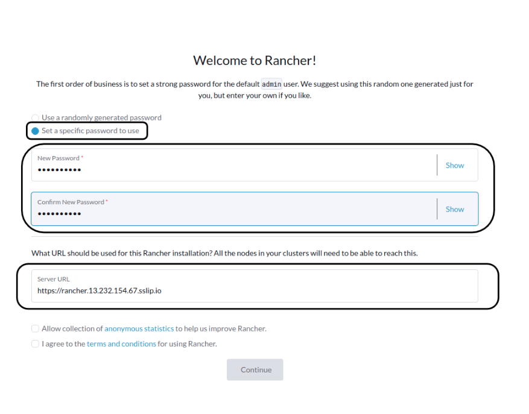
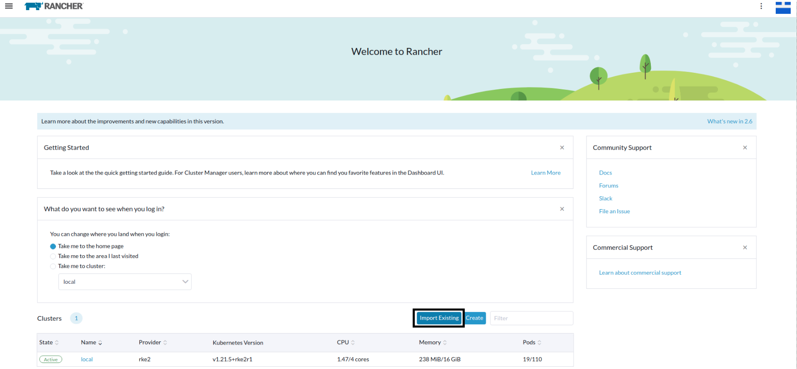
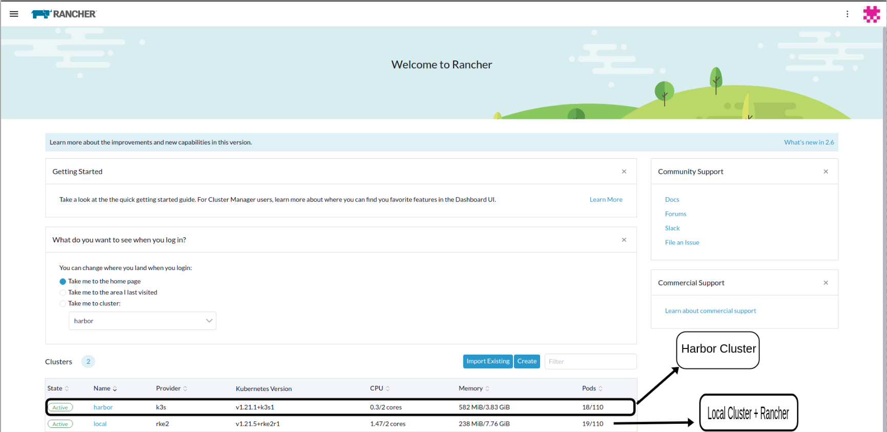
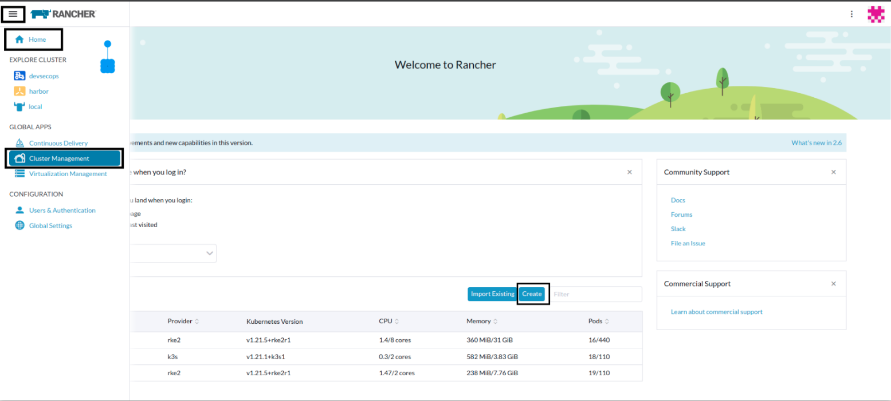
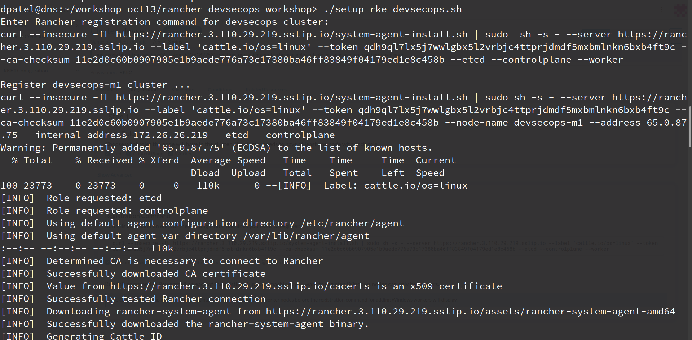
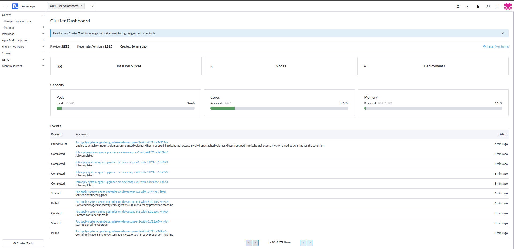
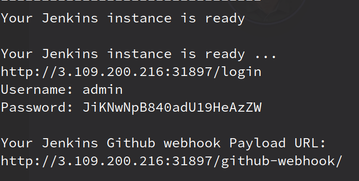
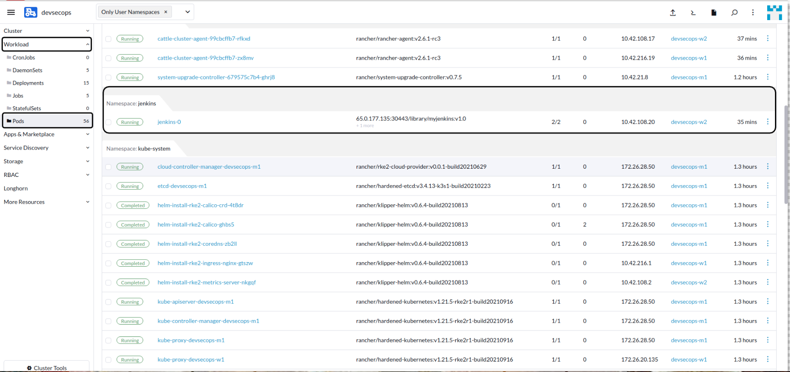
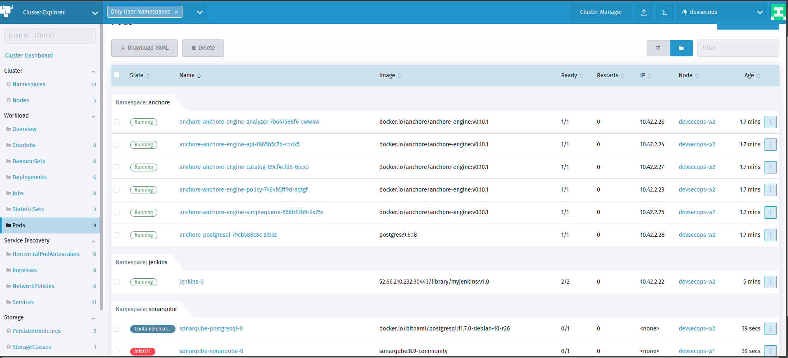

# Part 1 - Build Your Lab Environment on AWS Lightsail

This script will help you setup a lab environment with 8 VMs running on AWS Lightsail.

Estimated Completion Time: 45 mins

* Rancher Management Server v2.6.0 instance (1 VM)
* Harbor private registry running on K3S (1 VM)
* DevSecOps RKE cluster running `Jenkins`, `Anchore`, and `SonarQube` (3 VM - 1 master + 2 worker nodes)
* 2 single-node clusters (1 VM each) for deploying applications.

## Pre-requisites

* Github account
* AWS account with AWS Lightsail full admin access
* Linux workstation with `git` and `aws` command line v2 installed and AWS credential key configured.

## See Part 1 in Action

Watch the video below to see what we are going to do in this part.

[](https://www.youtube.com/watch?v=NuNhrw6JDTU)

## To build the lab on AWS Lightsail

### 1. Clone Git Repository

1) In your linux terminal, create a folder for the workshop and  checkout this repository into a local folder.

```
mkdir workshop && cd ~/workshop
```

```
git clone https://github.com/dsohk/rancher-devsecops-workshop workshop
cd workshop
```

2) To view the content for the Cloned Repo, in your terminal execute below command
```
cd ~/workshop/rancher-devsecops-workshop && ll 
```
you should see below sample outout. 
```
dpatel@dns:~> cd ~/workshop/rancher-devsecops-workshop && ll
total 40
-rwxr-xr-x 1 dpatel users  831 Sep 30 15:25 cleanlab.sh
drwxr-xr-x 1 dpatel users  120 Sep 30 15:25 docs
-rw-r--r-- 1 dpatel users 1065 Sep 30 15:25 LICENSE
-rw-r--r-- 1 dpatel users 1226 Sep 30 15:25 README.md
drwxr-xr-x 1 dpatel users  188 Sep 30 15:25 setup
-rwxr-xr-x 1 dpatel users  999 Sep 30 15:25 setup-rke-cluster1.sh
-rwxr-xr-x 1 dpatel users  999 Sep 30 15:25 setup-rke-cluster2.sh
-rwxr-xr-x 1 dpatel users 1846 Sep 30 15:25 setup-rke-devsecops.sh
-rwxr-xr-x 1 dpatel users 1014 Sep 30 15:25 show-mylab-env.sh
-rwxr-xr-x 1 dpatel users 8470 Sep 30 15:25 startlab.sh
```

### 2. Deploy VMs on AWS Lightsail and Setup Rancher Management Server

Run the `startlab.sh --help` to get list of options. You should see the output like below.

```
❯ ./startlab.sh --help
  ___ _   _ ___ ___   ___              _
 / __| | | / __| __| | _ \__ _ _ _  __| |_  ___ _ _
 \__ \ |_| \__ \ _|  |   / _` | ' \/ _| ' \/ -_) '_|
 |___/\___/|___/___| |_|_\__,_|_||_\__|_||_\___|_|


Welcome to SUSE Rancher DevSecOps Hands-on Lab on AWS Lightsail ...
This script will help you to provision VMs on AWS Lightsail to get started to run your lab exercise. By default, this script will install Rancher for you after VM is up.

usage: ./startlab.sh [options]
-s    | --skip-rancher              Skip deploying Rancher after VM is up.
-h    | --help                      Brings up this menu

```

1) Run `startlab.sh` to deploy VMs on AWS Lightsail and automatically setup Rancher management server. It will prompt you which AWS region you would like to run your lab. 

```
./startlab.sh
```

2) You will be prompted to choose which AWS Environment and region you are going to run your lab environment.

```
dpatel@dns:~/workshop/rancher-devsecops-workshop> ./startlab.sh 
  ___ _   _ ___ ___   ___              _            
 / __| | | / __| __| | _ \__ _ _ _  __| |_  ___ _ _ 
 \__ \ |_| \__ \ _|  |   / _` | ' \/ _| ' \/ -_) '_|
 |___/\___/|___/___| |_|_\__,_|_||_\__|_||_\___|_|  
                                                    

Welcome to SUSE Rancher DevSecOps Hands-on Lab on AWS Lightsail ...
This script will help you to provision VMs on AWS Lightsail to get started to run your lab exercise. By default, this script will install Rancher for you after VM is up.

usage: ./startlab.sh [options]
-s    | --skip-rancher              Skip deploying Rancher after VM is up.
-h    | --help                      Brings up this menu

Checking pre-requisites...
git installed
awscli v2 installed

Select Your Preferred AWS Environment to run your lab:
1) US/Canada
2) Europe
3) Asia
4) Quit
 3
Asia 
Select regions
1) Mumbai
2) Seoul
3) Singapore
4) Sydney
5) Tokyo
6) Quit

 1
You picked: Mumbai
Provisioning VM in your AWS Lightsail region ap-south-1 as lab environment ...
```

Choose the region closest to you to continue your lab setup. The script will then
a) Provision VMs on your AWS account with region you picked, 
b) Configure firewall rules for these VMs, 
c) Download AWS SSH keypair to your local folder to access to these VMs, and
d) Create shortcut files for you to access to the VMs in your lab environment.
e) Install Kubernetes tools (`Kubectl` & `helm`)
f) Deploy Rancher using Docker

#### Incase if you experience Error creating AWS Lighsail instance

Possible error `An error occurred (InvalidInputException) when calling the CreateInstances operation: We're sorry, your AWS account is pending verification. Please try again later`

Resolution - 
Perform cleanup by executing the below script. 
```
./cleanlab.sh
```
Post the cleanup re-run the startlab.sh script.

When the script has finished, you will see a table of VMs with IP addresses, the Rancher instance URL, and other useful files created in your local folder. For example, this is the extract of my output after running the startlab script.

*The IP addresses for you will be different from those in the screenshots in this lab guide.*

```
Your lab environment on AWS Lightsail ap-south-1 is ready. 

Here's the list of VMs running in your lab environment (See file: mylab_vm_list.txt):
-----------------------------------------------------------------------------
|                               GetInstances                                |
+-----------------------+--------------------+-------------------+----------+
|        VMname         | privateIpAddress   |  publicIpAddress  |  state   |
+-----------------------+--------------------+-------------------+----------+
|  suse0908-cluster2    |  172.26.31.243     |  65.2.78.40       |  running |
|  suse0908-devsecops-m1|  172.26.28.50      |  13.126.78.17     |  running |
|  suse0908-cluster1    |  172.26.19.112     |  15.207.115.122   |  running |
|  suse0908-devsecops-w2|  172.26.0.206      |  13.235.134.68    |  running |
|  suse0908-harbor      |  172.26.31.128     |  65.0.177.135     |  running |
|  demo-rancher         |  172.26.1.253      |  35.154.55.126    |  stopped |
|  suse0908-devsecops-w1|  172.26.20.135     |  3.109.200.216    |  running |
|  suse0908-rancher     |  172.26.26.107     |  13.232.154.67    |  running |
+-----------------------+--------------------+-------------------+----------+
To SSH into the VM on the lab, you can run this command:

./ssh-mylab-<vm>.sh

Your Rancher Server is ready.

Your Rancher Server URL: https://rancher.13.232.154.67.sslip.io
Bootstrap Password: 4rfkljvwb6ldbplfgfjg6tppwggbsq56mgl9npntltn4qpc6dhv9nf
```
3) Open the Rancher URL in a browser window. This may take few mins to get Rancher Instance up and running. 

4) Toggle back to the terminal and execute the below command to see the list of files (text and scripts).

```
ls -lh 

```
Sample output below.

```
dpatel@dns:~/workshop/rancher-devsecops-workshop> ll
total 104
-rwxr-xr-x 1 dpatel users  831 Sep 30 15:25 cleanlab.sh
drwxr-xr-x 1 dpatel users  120 Sep 30 15:25 docs
-rw-r--r-- 1 dpatel users 1065 Sep 30 15:25 LICENSE
-rw-r--r-- 1 dpatel users   29 Sep 30 15:53 mylab_aws_region.sh
-rw------- 1 dpatel users 1676 Sep 30 15:54 mylab.key
-rw-r--r-- 1 dpatel users  381 Sep 30 15:54 mylab.pub
-rw-r--r-- 1 dpatel users   34 Sep 30 15:53 mylab_rancher_version.sh
-rw------- 1 dpatel users  654 Sep 30 15:54 mylab-ssh-config
-rw-r--r-- 1 dpatel users 1043 Sep 30 15:54 mylab_vm_list.txt
-rw-r--r-- 1 dpatel users   26 Sep 30 15:53 mylab_vm_prefix.sh
-rw-r--r-- 1 dpatel users 1226 Sep 30 15:25 README.md
drwxr-xr-x 1 dpatel users  188 Sep 30 15:25 setup
-rwxr-xr-x 1 dpatel users  999 Sep 30 15:25 setup-rke-cluster1.sh
-rwxr-xr-x 1 dpatel users  999 Sep 30 15:25 setup-rke-cluster2.sh
-rwxr-xr-x 1 dpatel users 1846 Sep 30 15:25 setup-rke-devsecops.sh
-rwxr-xr-x 1 dpatel users 1014 Sep 30 15:25 show-mylab-env.sh
-rwxr-xr-x 1 dpatel users   67 Sep 30 15:54 ssh-mylab-cluster1.sh
-rwxr-xr-x 1 dpatel users   69 Sep 30 15:54 ssh-mylab-cluster2.sh
-rwxr-xr-x 1 dpatel users   69 Sep 30 15:54 ssh-mylab-devsecops-m1.sh
-rwxr-xr-x 1 dpatel users   67 Sep 30 15:54 ssh-mylab-devsecops-w1.sh
-rwxr-xr-x 1 dpatel users   66 Sep 30 15:54 ssh-mylab-devsecops-w2.sh
-rwxr-xr-x 1 dpatel users   55 Sep 30 15:54 ssh-mylab-devsecops-w3.sh
-rwxr-xr-x 1 dpatel users   55 Sep 30 15:54 ssh-mylab-devsecops-w4.sh
-rwxr-xr-x 1 dpatel users   66 Sep 30 15:54 ssh-mylab-harbor.sh
-rwxr-xr-x 1 dpatel users   66 Sep 30 15:54 ssh-mylab-rancher.sh
-rwxr-xr-x 1 dpatel users 8470 Sep 30 15:25 startlab.sh

```

You can access to any of your VMs with the `ssh-mylab-<VM>.sh` script. The IP addresses of your VMs are also captured in the file `mylab_vm_list.txt`

### 3. Setup Harbor instance and Import into Rancher 

We will be using Harbor as our Private Registry

While we are waiting Rancher Server instance to be ready, let's setup your harbor private registry.

The script will,   
a) Provision K3s cluster.
b) Deploying Harbor (using Helm Chart v1.7.2 & App v2.3.2) on K3s.
c) Configure Harbor CA cert locally 
d) Downloading Docker Images for Maven, Java Libaries for Maven and Sles15sp3-openjdk and importing them into Harbor. 

a) Login to your harbor instance VM with SSH from your linux workstation.

```
./ssh-mylab-harbor.sh
```
Sample output below indicates you are on Harbor VMs Terminal.

```
dpatel@dns:~/workshop/rancher-devsecops-workshop> ./ssh-mylab-harbor.sh
openSUSE Leap 15.2 x86_64 (64-bit)

As "root" use the:
- zypper command for package management
- yast command for configuration management

Have a lot of fun...
suse0908-harbor ec2-user@ip-172-26-22-139:~>

```
b) On the Harbor VMs Terminal, run the script below to automatically setup harbor private registry on K3S in this VM instance.

```
./99-one-step-install-harbor.sh
```
Sample output below show Harbor URL and Admin User credentials. 

**Please do NOT change the harbor login credential as the lab assumes to use the randomly generated strong password throughout the rest of the setup**.

```
============================================================
Congrats! Your Harbor instance has been setup successfully.
URL: https://54.153.196.73:30443
User: admin
Password: J4diXo8ZKddi5mFGEgx1Z3XveoOuPw
```
c) Open Harbor URL in a browser and log into Harbor using credentials provided as in sample output 

#### Import Harbor cluster in Rancher.

In this step, we would be importing Harbor K3s cluster into Rancher. 

a) You should be logged into `Harbor VM` for this, incase if your terminal timeout or for any reason you are not on Harbor VMs, please execute the script below which will automtically take you to the Harbor VMs Terminal.
```
./ssh-mylab-harbor.sh
```
b) Open browser to navigate to the Rancher URL captured in earlier step.

Sample output
```
Your Rancher Server URL: https://rancher.13.232.154.67.sslip.io
Bootstrap Password: 4rfkljvwb6ldbplfgfjg6tppwggbsq56mgl9npntltn4qpc6dhv9nf
```
By pass the invalid SSL certificate warning, you should be prompted a `Welcome to Rancher` page. 
Provide the bootstrap password generated during setup. Hit `Log in with Local User`


Following page will be presented with 
a) You can setup your own administrative password  by selecting `Set a specific password to use`
b) You will be presented with Rancher URL
Accept the Terms and Conditions



Finally you will be presented with the Rancher Homepage


3) Import Harbor cluster
a) On Rancher Homeage, click on `Import Cluster` to import a existing cluster with `Generic` option.




b) Enter the custer name as `Harbor` and leave the rest of the setting as default & click on `Create`. 


c) You will be prompted with a set of commands. 
Last command which says `Rancher installation has self signed trusted SSL certificate`, copy the command and paste the command on the Harbor VMs Terminal to import the cluster. 


Incase if you see below messages, 
```
error: no objects passed to apply
```
Re-run the command again using the Up arrow key from keyboard.


d) You can now toggle to Rancher UI and should find Harbor Cluster successfully imported




### 4. Provision DevSecOps RKE cluster from Rancher UI

In this step, we will be provisioning RKE cluster with One Master & Two worker Nodes along with thier Private, Public and Node names along with thier role. We have scripted this process to match the lab requirement. 

In the following step, we will add `devsecops` cluster in Rancher.

a) Navigated to Rancher Cluster Management UI. Click `Create` button. 



You will be presented `Cluster:Create` page. 

Under section `Provision a new node and create a cluster using RKE2/K3s (Tech Preview)`, toggle the switch `RKE2/k3s`. With Rancher 2.6 you can now provisoin RKE2 & K3s cluster via Rancher UI.

To create a new cluster choose the `custom` option to provision clusters on existing nodes 
 


b) You will be presented with `Cluster:Create Custom`form. Enter the cluster name as `devsecops` and leave the rest of the settings as default and click `Create` button. You will be presented with cluster registration command to create the RKE cluster on your VM. Click on `registration command` to copy the command into your clipboard.


c) Open your Linux workstation terminal and switch to the working directory where this repo has been checked out. 

Run the script `./setup-rke-devsecops.sh` and paste the command you copied into the prompt from this script.

```
./setup-rke-devsecops.sh
```
```
❯ ./setup-rke-devsecops.sh
Enter Rancher registration command for devsecops cluster:
```
Sample output below




d) Return to your browser with Rancher UI, you should see the `devsecops` cluster is being initialized. It may take 5-10 minutes to complete the whole RKE cluster setup.

While the devsecops cluster is being provisioned, you can continue with step 5 for provisioning additional RKE clusters.


Cluster Explorer View for details




### 5. Provision additional RKE Clusters 
In this steps, we will be provisioning two single node RKE cluster with Etcd, Control Plane & worker all 3 components, co-existing on single node hence called (All-in-One) RKE Cluster. 

#### All-In-One RKE clusters 

a) Ensure you are on your local workstation/machine Terminal and inside your git repo cloned.

```
cd ~/workshop/rancher-devsecops-workshop
```
b) At the terminal, run the below script. 

```
./setup-rke-cluster1.sh
```
The Terminal will be seeking input command to create the cluster. The command for creating the cluster will be generate in the following step below.

c) Navigate to Rancher Cluster Management UI, click `Create`


You will be presented with `Cluster:Create` form. To create a new cluster, choose `Custom`to provision cluster using RKE2/K3s on existing node.


In `ClusterName` type `cluster1`
Under `Cluster Configuration` `Basics` form leave everthing as default. 


In `Labels & Annotation` tab, under `Labels`, provide the key:vaue pair. In `Key` type `evn` and  `Value` type `dev` and hit `Create`


You will be presented with `Registration` tab. Click on the command to copy. 


Paste the registration command on your terminal to start the cluster build process. 


d) Toggle to Rancher UI to veiw the newly registered `cluster1`


#### Provision additional RKE Cluster, All-In-One RKE clusters `Cluster2`

We are currently on the local workstation Terminal where we have our git repo cloned.

Sample output below.
```
dpatel@dns:~/devsecops-workshop/workshop>
```
1) At the terminal, run the below script 
```
./setup-rke-cluster2.sh
```

2) Repeat the step a, to d from previous section. 

Two important things to note

a) Cluster name will be `cluster2` 
b) In `Labels & Annotation` tab, under `Labels`, provide the key:vaue pair. In `Key` type `evn` and  `Value` type `dev`
c) Finally we should see both clusters `cluster1` and `cluster2` visible in Rancher.


### 6. Download KUBECONFIG file of DevSecOps cluster into Harbor VM
a) In Rancher UI > Global Apps > Cluster Management > `devsecops` hit the `Explorer` button.


b) In the devsecops cluster, toward the righthand corner look for `file` like icon. Click on it and it would download the KubeConfig file.


c) On your linux workstation, ssh into your harbor VM by executing the script `ssh-mylab-harbor.sh` script). 

```
./ssh-mylab-harbor.sh
```
d) Create a file `devsecops.cfg` under `~/.kube` folder.

```
vi ~/.kube/devsecops.cfg
```
e) Open the downloaded `KubeConfig` file which should be in download folder & paste the KubeConfig content. Save and exit.

f) If you see the below sample message 

`Kubernetes configuration file is group-readable. This is insecure. Location: /home/ec2-user/.kube/devsecops.cfg`

Modify the file permission by removing additional permissions.

```
chmod 600 ~/.kube/devsecops.cfg
```
g) Configure Kubernetes client to use this kubeconfig file. 

```
export KUBECONFIG=~/.kube/devsecops.cfg
```

h) Verify if it can connect to your devsecops cluster. If you see an output like below, you are good.

```
kubectl get nodes
```
Sample output below


### 7. Install Longhorn on DevSecOps Cluster

1) If you are not already logged into Harbor VM then run the script `ssh-mylab-harbor.sh` script), else skip to step 2 

```
./ssh-mylab-harbor.sh
```

2) Type the below command to deploy Longhorn 

```
cd devsecops/longhorn
./99-one-step-install-longhorn.sh
```
You should see below output with successfully deployment of Longhorn


3) In Rancher UI > Global Apps > Cluster Management > `devsecops` > Explorer > `Longhorn` 


### 8. Deploy Jenkins, Anchore and Sonarqube on devsecops RKE cluster from Harbor VM

In our final step for part 1, we are going to deploy the following in parallel.

* Jenkins (approx 5 mins)
* Anchore (approx 3/4 mins)
* Sonarqube (approx < 6 mins)

1) If you are not already logged into Harbor VM then run the script `ssh-mylab-harbor.sh` script), else skip to step 2 

```
./ssh-mylab-harbor.sh
```
2) Open two additional terminals, as we will run the deployment of Jenkins, Anchore & Sonarqube one after.


3) In terminal 1 of your Harbor VM, run the following command to setup Jenkins.

```
cd ~/devsecops/jenkins
./99-one-step-install-jenkins.sh
```
This should take a while to build Jenkins along with required plugin of our choice to be built in `devsecops` cluster.






Here's a high level view of what has been accomplished

a) Deployment & configuration of self signed certificate with Harbor. Self Signed Certificated are distributing to all Labs VMs. With help of Docker Client, we are able to login in the VM using self signed certifiate. 

b) Pulling Jenkins Image, building custom Jenkins image with own choise of plugins for this lab and adding it to Harbor registry.

c) Provisioning Jenkins using Helm Chart

d) Configuring Jenkins GitHub webhook

4) In Terminal 2 of Harbor VM, run the following command to setup Anchore 

```
cd ~/devsecops/anchore
./99-one-step-install-anchore.sh
```


It will also take awhile to deploy anchore on your devsecops cluster. Likewise, let's continue our lab to deploy Sonarqube.

5) On Terminal 3 on Harbor VM, run the following command to setup Sonarqube.

```
cd ~/devsecops/sonarqube
./99-one-step-install-sonarqube.sh
```


For all inquisite people, you can also check the deployment and the pod creation for these application in your `devsecop` cluster.

6) Toggle to your browser on Rancher UI.

Click on `Cluster Explorer` for `devsecops` cluster. In the `Pods` section, you will be able to see the application container in their respective namespaces

Since the application are been deployed, you will see in sample output below you would find container are `container creation` or `initilization` stages. 



Once all container are up and running & in ready state our output will be as below.


With this, we are ready to move to the [Step 2 - Configure GitHub and Jenkins](part-2.md)

