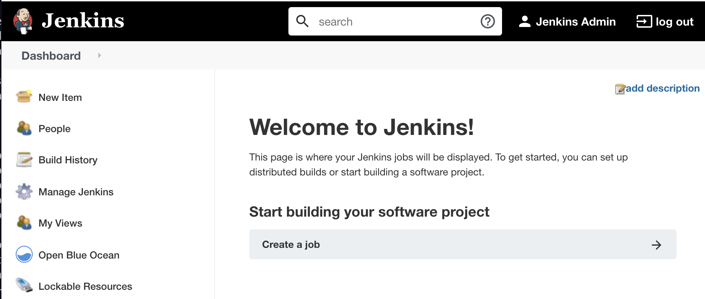
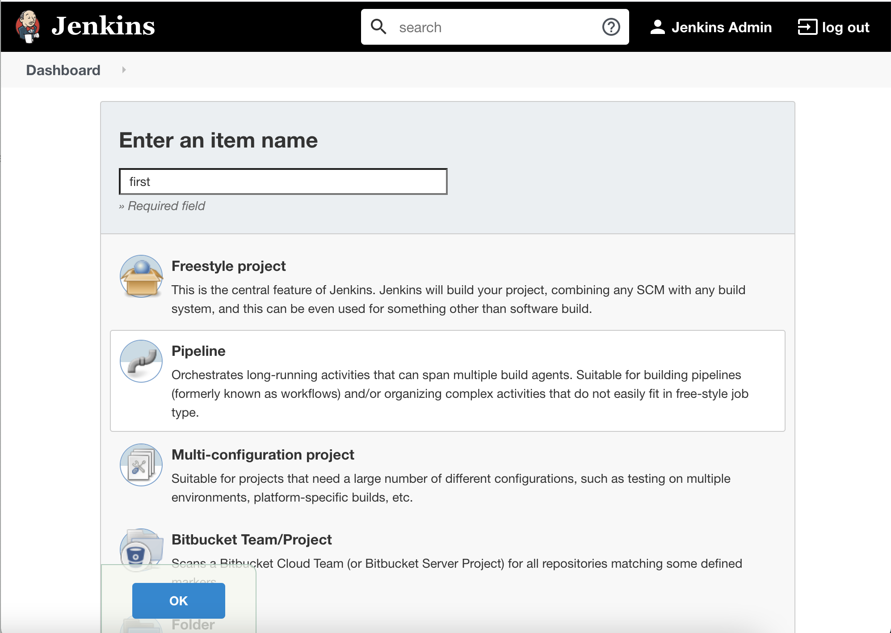

# Part 2 - My First Jenkins Pipeline

With Jenkins, Sonarqube, Anchore running on the Rancher-managed devsecops cluster, let's build our very first Jenkins pipeline.

## Build my first Jenkins Pipeline

1. Login to Jenkins with the URL and credentials generated from Part 1.
2. Click `Create Job`

3. Enter a name `first`
4. Choose `Pipeline` and click OK.

5. Jenkins will navigate to the Configure Pipeline page, navigate to Pipeline section

6. Choose `try sample Pipeline` pulldown menu.
7. Choose `Declarative (Kubernetes)`
8. Click `Save` button
9. On the left menu, click `Build Now` to trigger the first jenkins pipeline.

## Build my second Jenkins Pipeline

Like the first pipeline, create the `second` pipeline but this time choose `Maven (Kubernetes)` from `try sample Pipeline` pulldown menu.

Click `Build Now` to trigger the second Jenkins pipeline.

You should now have 2 pipelines created in Jenkins which will create Kubernetes pods on Rancher-managed cluster to run each job. 

## Examine Cluster Explorer in Rancher

Now, let's examine in the pods in Rancher. You will notice the pods will be created on demand everytime when the Pipeline runs and got terminated once it's finished.

With the Jenkins being verified to work well with Rancher-managed Kubernetes, let's move on to 
[Step 3 - Build CI Pipeline for spring-petclinic](part-3.md).

