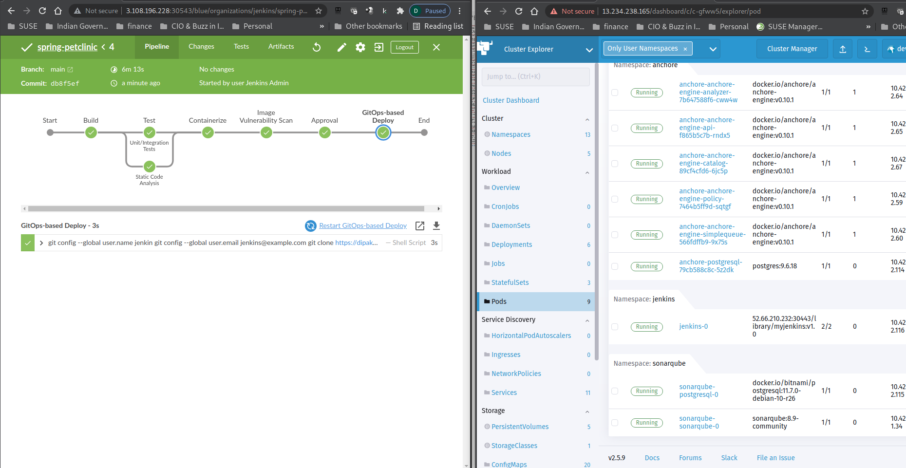

# Part 3 - Configure Jenkins Pipeline to deploy spring-petclinic App

Watch a video to explain what we are going to do in part 3:

## Build my First Jenkins Pipeline

1. Login to Jenkins.

2. Click `Create Job`

3. Enter a name `first`
4. Choose `Pipeline` and click OK.

5. Jenkins will navigate to the Configure Pipeline page, navigate to Pipeline section

6. Choose `try sample Pipeline` pulldown menu.

7. Choose `Declarative (Kubernetes)`

8. Click `Save` button

9. On the left menu, click `Build Now` to trigger the first jenkins pipeline.

10. With the first Jenkins job we are building an simple contianer with Ubuntu Image & deploying on Kubernetes Cluster `devsecops`. Once the job is completed the Container get terminated 

Click on Status inside the job to view job status.

In the above illustration, under `build history` you will find `#1` which indicated our first build job is completed and green check mark indicates job is build successfully.

During the Pipeline build stage, you can also toggle to Rancher UI to see the container spining up & terminating once the job is done, 

In Rancher UI, Toggle to `devsecops` cluster. Click on `Cluster Explorer` & in `Pods` section you can see the progress of Jenkins jobs under Jenkins Namespace.

Below images illustrates the Jenkins pipeline has successfully create the pods & later you can see it getting terminated once the job is completed successfully

## Build my second Jenkins Pipeline

Like the first pipeline, create the `second` pipeline but this time choose `Maven (Kubernetes)` from `try sample Pipeline` pulldown menu.

Click `Build Now` to trigger the second Jenkins pipeline.

With our 2nd job, we are building a simple `Maven` container.

You should now have 2 pipelines created in Jenkins which will create Kubernetes pods on Rancher-managed cluster to run each job. 

## Examine Cluster Explorer in Rancher

Now, let's examine in the pods in Rancher. You will notice the pods will be created on demand everytime when the Pipeline runs and got terminated once it's finished.

Rancher UI select DevSecOps Cluster & click explorer 

In the left hand navigation plane select Pods

Select Jenkins Namespace from dropdown. 

In the Pod Plane you should see Jenkins and your pipeline pods been created & then once the job is over getting teminated 

Image below will illustrate the same.

## Setup CI Pipeline for spring-petclinic project

1. Navigate to the Jenkins Dashhoard page
2. Choose `Open BlueOcean` item in the left menu
3. Click `New Pipeline` button
4. Choose `Github` tor respond to Where do you store your code question.
5. Enter your Github personal access token and click `Connect`
6. Choose your github organization.
7. Choose your forked project `spring-petclinic` and click `Create Pipeline` to continue.

Click `Build Now` to run this pipeline. 

We see the Jenkins build job status in Jenkins and we also see the corresponding Jenkins worker running the container build job in `Jenkins-workers` Namespace with job id `spring-petclinic-b6f6771f-ss3vx-fccj4`

On successful completion of the job. Sample below

It may take about 20 minutes to finish this pipeline at  the first time. The next run will be faster as all the builds or dependent artifacts are cached in the persistent volume used by the pods for this job.

While we are waiting the first run of this pipeline executing, let's move on to the [Part 4 - Rancher Continuous Delivery](part-4.md). We will come back to revisit the pipeline later. 
