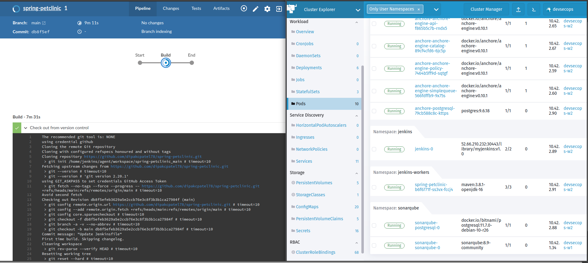

# Part 3 - Configure Jenkins Pipeline to deploy spring-petclinic App

Watch a video to explain what we are going to do in part 3:

## Build my First Jenkins Pipeline

Befre we start the Pipeline, you may want open Rancher UI in a browser window.

`Cluster Explorer` view for cluster `devsecops`.
`Pods` > `Jenkins` Namespace. 

Here you will see the container creation, status and termination as things progress.

Open Jenkins in new browser window.

1. Login to Jenkins. If you are already on Jenkins then click on Dashboard.

2. Click `Create Job`

3. Enter a name `first`
4. Choose `Pipeline` and click OK.

5. Jenkins will navigate to the Configure Pipeline page, navigate to Pipeline section

6. Choose `try sample Pipeline` pulldown menu and choose `Declarative (Kubernetes)`

7. Click `Save` button

8. On the left menu, click `Build Now` to trigger the first jenkins pipeline.

9. With the first Jenkins job we are building an simple contianer with Ubuntu Image & deploying on Kubernetes Cluster `devsecops`. Once the job is completed the Container get terminated 

To view the job and it's status, click on Status inside the job within Jenkins UI.

Left hand bottom of UI, under `Build History` you will find `#1` which indicated our first build job and `green` check mark indicated job is completed successfully.

Toggle to Rancher UI Window to see the progress of Jenkins jobs. 

Sample Screenshot

## Build my second Jenkins Pipeline

Like the first pipeline, create the `second` pipeline but this time choose `Maven (Kubernetes)` from `try sample Pipeline` pulldown menu.

Click `Build Now` to trigger the second Jenkins pipeline.

With our 2nd job, we are building a simple `Maven` container.

Sample Screenshot of Jenkins Console Output & Rancher UI as reference.

You now have 2 pipelines created in Jenkins

## Setup CI Pipeline for spring-petclinic project

1. Navigate to the Jenkins Dashhoard page
2. Choose `Open BlueOcean` item in the left menu
3. Click `New Pipeline` button
4. Choose `Github` tor respond to Where do you store your code question.
5. Enter your Github personal access token and click `Connect`
6. Choose your github organization.
7. Choose your forked project `spring-petclinic` and click `Create Pipeline` to continue.
8. Click `Build Now` to run this pipeline. 

Pipeline will take about 20+ minutes to finish.

You can view the progress in the BlueOcean Plug-in/Jenkins UI and Rancher.

Below are two screenshot for the pipeline progression where `spring-petclinic` app is been build using `Maven` and you can see the container in Rancher UI.

As indicated this will take 20+ mins, let's move on to the [Part 4 - Rancher Continuous Delivery](part-4.md). We will come back to revisit the pipeline later. 

----------------------------------------------------------
@ Derek, will take off the below content or cover this in next part `part4`

At one stage in the pipline we will be asked to approve the code, sample below. 

On successful completion of the job. Sample below

It may take about 20 minutes to finish this pipeline at  the first time. The next run will be faster as all the builds or dependent artifacts are cached in the persistent volume used by the pods for this job.

