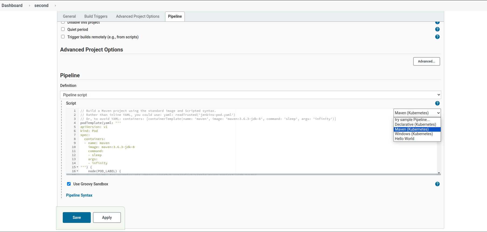
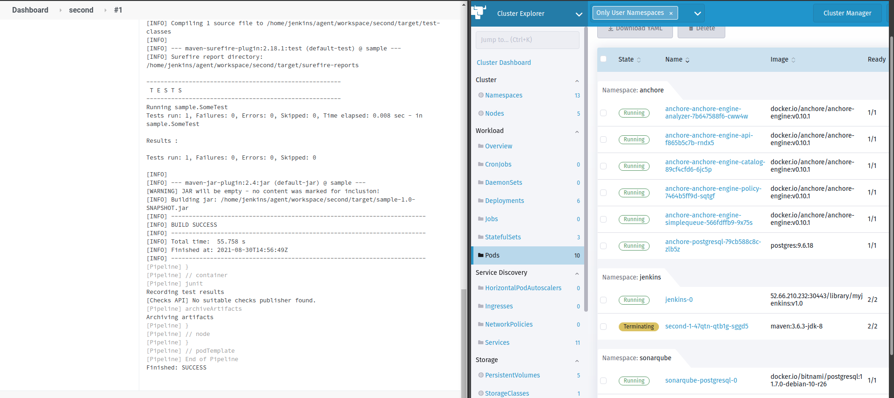
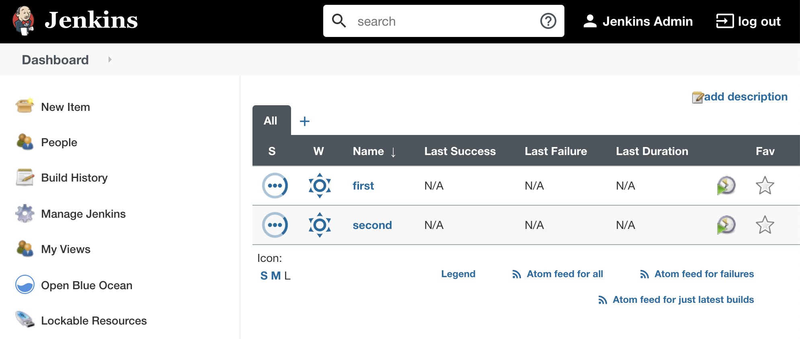

# Part 3 - Configure Jenkins Pipeline to deploy spring-petclinic App

Watch a video to explain what we are going to do in part 3:

## Build my First Jenkins Pipeline

Before we start the Pipeline, you may want open Rancher UI in a browser window.

`Cluster Explorer` view for cluster `devsecops` > `Pods` > `Jenkins` Namespace. 

Here you will see the container creation, status and termination as things progress.

1) Open Jenkins in new browser window and login.

2) Click `Create Job`

a) Enter a name `first`
b) Choose `Pipeline` and click OK.

c) Navigate to the `Pipeline` section on the `Configure Pipeline` page.

d) Click on `try sample Pipeline` dropdown menu and choose `Declarative (Kubernetes)`

e) Click `Save` button

3) On the left menu, click `Build Now` to trigger the first jenkins pipeline.

With the first Jenkins job we are building an simple container with Ubuntu Image & deploying on Kubernetes Cluster `devsecops`. Once the job is completed the container will terminate. 

4) To view the job and it's status, click on `Status` inside the job within Jenkins UI.

Left hand bottom of UI, under `Build History` you will find `#1` which indicates our first build job and `green` check mark indicates that the job has completed successfully.

5) Toggle to Rancher UI Window to see the progress of Jenkins jobs. 

Sample Screenshot

## Build my second Jenkins Pipeline

1) Similar to your first pipeline, create the `second` pipeline. This time choose `Maven (Kubernetes)` from `try sample Pipeline` pulldown menu.

2) Click `Build Now` to trigger the second Jenkins pipeline.

With our 2nd job, we are building a simple `Maven` container.

Sample Screenshot of Jenkins Console Output & Rancher UI as reference.

You now have 2 pipelines created in Jenkins

## Setup CI Pipeline for spring-petclinic project

a) Click on `Open BlueOcean` in the left menu
b) Click `New Pipeline` button
c) Choose `Github`, enter your Github personal access token and click `Connect`
d) Choose your github organization.
e) Choose your forked project `spring-petclinic` and click `Create Pipeline` to continue.
f) Click `Build Now` to run this pipeline. 

Pipeline will take about 20+ minutes to finish.

You can view the progress in the BlueOcean Plug-in/Jenkins UI and Rancher.

Below are two screenshot for the pipeline progression where `spring-petclinic` app is been build using `Maven` and you can see the container in Rancher UI.

While the pipeline is in progress, let's move to the [Part 4 - Rancher Continuous Delivery](part-4.md). We will come back to revisit the pipeline later. 
