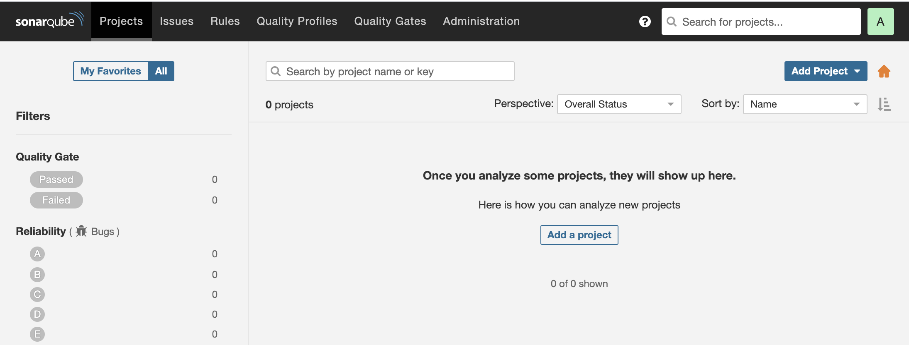
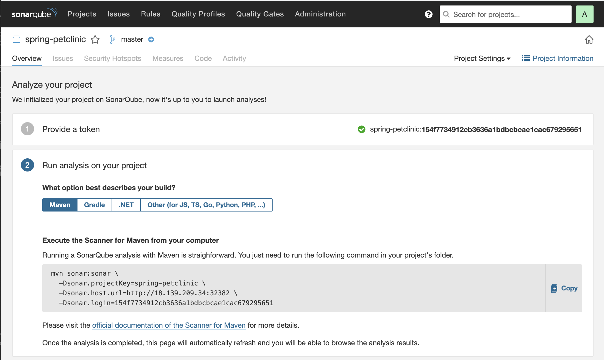

# Part 3 - My Jenkins Pipeline for spring-petclinic App

After we have configured and verify Jenkins is working, let's build the spring-petclinic application.

## Setup my Github

### 1. Generate my Personal Access Token

In order to integrate Jenkins with your github account, we have to generate your personal access token for this.

1. Login to your github account
2. Under your avatar icon, pull down the menu and choose `Settings` menu item.
3. Choose `Developer Settings` menu on the left, choose `Personal Access Tokens`
4. Click `Generate new token` button.
5. Enter `workshop` (or whatever you like) in the name field.
6. Choose `repo` and `user:email` in the privieged for this token.
7. Save and record down the generated token for configuring CI Pipeline in Jenkins later.

### 2. Fork the spring-petclinic project into your own github account

Open a new Browser & past the below link

```
https://github.com/dsohk/spring-petclinic
```
Click on Fork Icon on top right hand window pane & select your own account where the repo will be forked.

In GitHub, navigate to your forked repoistory. Find the code in `Jenkinsfile` and replace `yourname` with your github account name.


### 3. Fork the spring-petclinic-helmchart project into your own github account

Open a new Browser & past the below link

```
https://github.com/dsohk/spring-petclinic-helmchart
```
Click on Fork Icon on top right hand window pane & select your own account where the repo will be forked.

Once the above 2 Repo are forked, those repo are available in your GitHub account. 
You can check your Repositories to validate. 


## Setup my Sonarqube

Sonarqube URL & details are stored in Harbor VM. 

Execute the below script to log into Harbor
```
./ssh-mylab-harbor.sh
```

Execute the below command on the Harbor Terminal to get Sonarqube URL & Credentials.

```
cat mysonarqube.txt
```

1. Login to your Sonarqube instance with the generated credential from Part 1. Upon successful login, you will be prompt to change your inital password. 
2. Choose `Add a Project`. 



3. Select `Manually` to continue
3. Enter `spring-petclinic` in Project Key and Display Name input field.
4. In the Provide a token input field, enter `spring-petclinic` and click `Generate Token` button.
5. Record the generate token.
6. In responding to Run Analysis on your project, choose `maven`. This will give you a code snippet as part of your Pipeline. For example,



@Derek, is there somethings we need to using the above command ? 
Its say you need to run the command in your project folder. Not able to follow this?

## Setup my Jenkins

Execute the below script to log into Harbor
```
./ssh-mylab-harbor.sh
```

Execute the below command on the Harbor Terminal to get Jenkins URL & Credentials.

```
cat myjenkins.txt
```

### Configure Jenkins System

1. Login to Jenkins
2. Configure Credentials for Sonarqube 

### Configure Credentials 
Login into Jenkins. 
Manage Credentials. 
Click on Stores scoped to Jenkins to add additional credentials to Jenkins
Click on Jenkins & then click on Global Credentials (unrestricted)
Click on `Add Credentials`
Under `Kind` click  on drop down menu & select `Secret text`
Under Secret copy & paste the token derived during token generation in Sonarqube in previous steps.

Under ID type `SonarQube-Spring-petclinic`

3. Navigate to `Managing Jenkins`, then `Configure System`.

#### Setup Global Environment variables

Go to `Global Properties` section. Define the following environment variables

1. Enable Global Environment Variables by clicking in the box 

Environment Varaiable will then show list of variables where you can click on `add` to add new varaiables. 

Add 3 variables as mentioned below in step 2.

2. Add New Environment Variable
   a) Key: HARBOR_URL
   b) Value: (Your Harbor_URL) (just IP:PORT - no http:// or https://)
   
To know your Harbor URL, execute the below commands

```
./ssh-mylab-harbor.sh
```
```
cat harbor-credential.txt
```

#### Sonarqube

Click on Environment Variable Enable injection of SonarQube

Click on `Add SonarQube`

1. Name: My SonarQube (Please use the name as mentioned in the instruction) or copy & paste using below clipboard
```
My SonarQube
```
2. Add URL: (Your Sonarqube URL)

To find Sonarqube URL ssh into Harbor VM using the script below. 

```
./ssh-mylab-harbor.sh
```
```
cat mysonarqube.txt
```

3. Add generated token 
  Add Credential > Jenkins
  Kind Secret text: 
  Secret: (from Sonarqube generated token)
  ID: sonarqube-spring-petclinic

4. Sample Output would look like


#### Git plugin

1. Global Config user.name : jenkins
2. Global Config user.email: jenkins@example.com

#### Anchore Container Image Scanner

1. Engine URL: (Your Anchore URL)
2. Engine Username: (Your Anchore username)
3. Engine Password: (Your Anchore password)


### Configure the credentials

1. In Jenkins, navigate to `spring-petclinic` Project
2. Choose `Credential` on the left menu
3. Under store `spring-petclinic` global pull down menu and choose `Add Credential`

spring-petclinic-helmchart-git-token
(same git token)

## Setup CI Pipeline for spring-petclinic project

Left menu:
  Open BlueOcean
  Create a New Pipeline
  -> Choose Github
  -> Enter your personal access token
  -> Choose spring-petclinic project 

Click `Build Now` to run this pipeline. It may take longer for the first time to run this pipeline. The subsequent run will be faster as all the builds or dependent artifacts are cached in the persistent volume used by the pods for this job.


