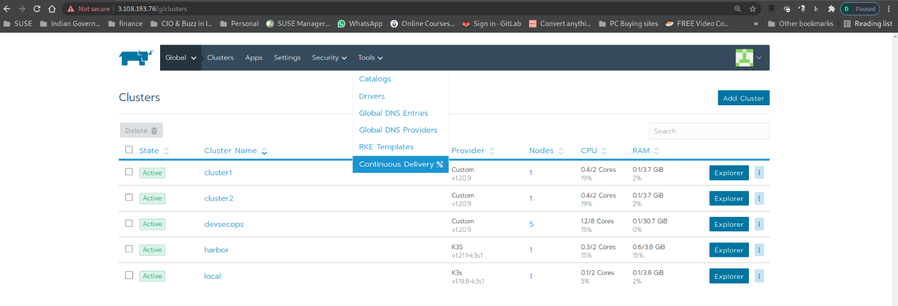
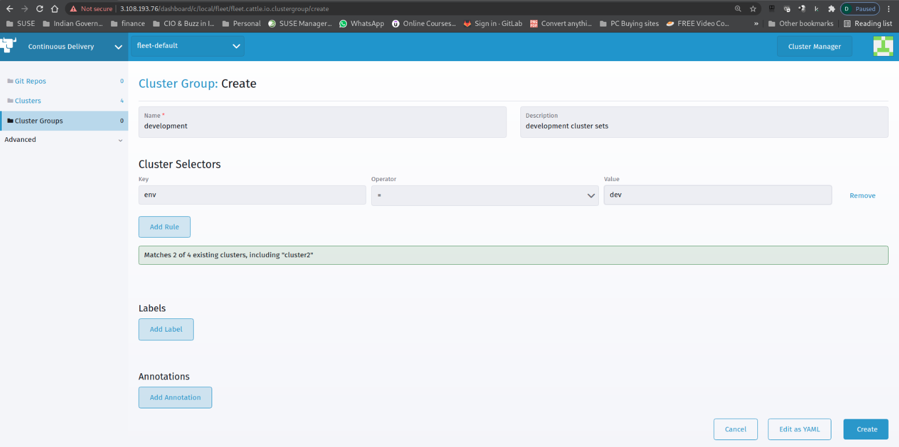

# Part 4 - Rancher Fleet - Continous Delivery 

## 1. Provision all-in-one RKE clusters on VM (cluster1 and cluster2)

Open browser to navigate to the Rancher URL captured in earlier steps. Authenticate by providing your Rancher credentials.

You will now be navigated to Rancher Cluster Management UI. Click `Add Cluster` button to create new kubernetes cluster with RKE and existing bare-metal servers or virtual machine `Existing Node` option. 


Enter the cluster name as `cluster1`, Under `Labels & Annotation` field, add Label with key value pair `env` and `dev`. Leave the rest of the setting as default and click `Next` button. 


You will be prompted with a command to setup RKE on your VM. Click the `copy` icon to copy the command into your clipboard.


On your linux terminal, execute the below script to access your cluster1 terminal 

Copy the script below to ssh into the cluster1 
```
./ssh-mylab-cluster1.sh
```
Copy & paste the command from Rancher UI on the terminal of VM - Cluster1.


On Rancher UI, you will see cluster 1 coming in few mins. 


Cluster 1 is successfully provision in Rancher

### 2. Provision all-in-one RKE cluster on VM (cluster2)

Repeat all step from step1 for adding cluster 2
Make sure you name the cluster as `Cluster2`


### 3. Configure Rancher Fleet - Continous Delivery

To setup Fleet, from Rancher UI, Cluster Manager Page select `Tools` and click on `Continous Delivery`




Before we go any further, let verify if we can see all our cluster in Rancher FLeet


In Fleet you can manage indivisual or group of clusters. Managing cluster via Group reduces adminstrative efforts. 

To create Cluster Group in Continous Delivery, click on Cluster Groups option in left plane & hit `Create`


Provide unique `Name` for cluster group and in `Cluster Selector` section, provide same Label key value pair which was used to create `Cluster1` and `Cluster2`

Key:Value `(env=dev)` 

Once you key in the key:value pair, Rancher will use the selector labels to indentify the clusters to be associated with our newly created cluster group in Fleet. You will see it show 2/4 cluster been selected. 



Hit `Create` which will create our first Cluster Group.


Once our Cluster Group is created, we then need to define a Git Repo for Fleet.

#### 4. Configure Git Repo

To configure Git Reop, click on `Create` in Git Repos page in Continous Delivery

You would need to provide 

Name:

Repository URL: forked PetClinic Repo which is now avaiable in your GitHub Account. In my case it's `https://github.com/dipakcpatel78/spring-petclinic.git`

Incase if you are not sure, please visit your GitHub Account & under Repo search for Spring-Petclinic & click on `Code` to get the URL. Sample below for reference. 


Branch Name: Note Branche Name is `main` in our case & not `master`

Deploy To - Cluster/Cluster Group. In my case `development`

Rest all default.

Sample output of the GitRepo configuration


With this, let's put everything together and proceed to [Part 5](part-5.md)

