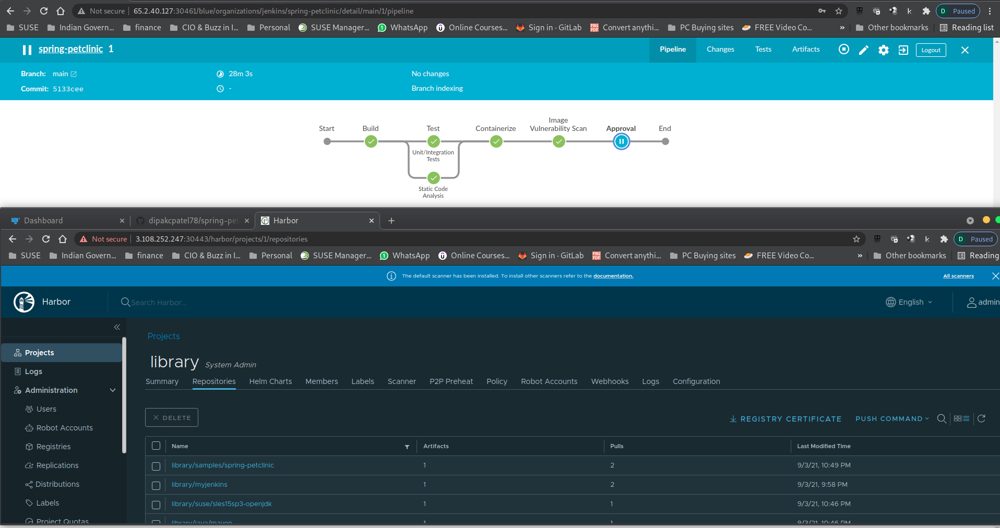
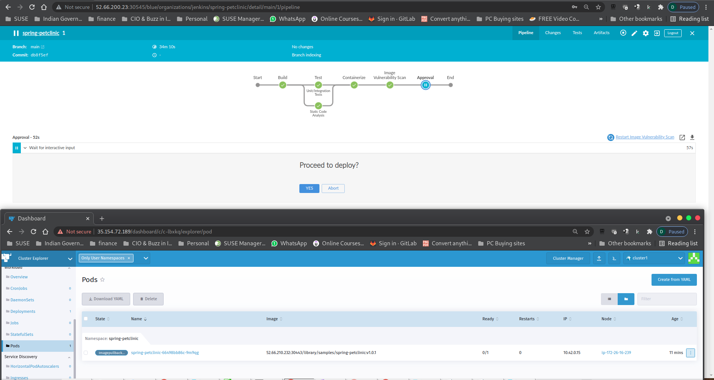

# Part 4 - Rancher Fleet - Continous Delivery 

## 1. Configure Rancher Fleet - Continous Delivery

To setup Fleet, from Rancher UI, Cluster Manager Page select `Tools` and click on `Continous Delivery`

Before we go any further, let verify if we can see all our cluster in Rancher FLeet

In Fleet you can manage indivisual or group of clusters. Managing cluster via Group reduces adminstrative efforts. 

To create Cluster Group in Continous Delivery, click on Cluster Groups option in left plane & hit `Create`

Provide unique `Name` for cluster group and in `Cluster Selector` section, provide same Label key value pair which was used to create `Cluster1` and `Cluster2`

Key:Value `(env=dev)` 

Once you key in the key:value pair, Rancher will use the selector labels to indentify the clusters to be associated with our newly created cluster group in Fleet. You will see it show 2/4 cluster been selected. 

Hit `Create` which will create our first Cluster Group.

Once our Cluster Group is created, we then need to define a Git Repo for Fleet.

#### 4. Configure Git Repo

Before we ahead for configuring the Git Repo, we need to Git Repository URL.

Follow the instruction below to get to Git Repository URL.

Open you GitHub. You will find your repository on left hand side of the page. If you still not able to find, use the search option and specify the repository name `spring-petclinic-helmchart` 

Click on the Repository URL and you will be taken into the `code` tab. 

In the code page, you will be in the `main` branch & you will see `code` tab. Click on the drop down menu of Code tab and you will be presented with the repositroy url. Click on the clipboard icon to copy the URL from `HTTPS` tab. 

Sample below for reference. 

We are not ready to Configure our Git Repo

To configure Git Reop, click on `Create` in Git Repos page in Continous Delivery. Provide details to complete the form page.  

Name: 

Repository URL: `https://github.com/<github-id>/spring-petclinic-helmchart.git`

Branch Name: NOTE Branche Name is `main` and not `master`

Deploy To: Cluster/Cluster Group. In my case `development`

Branch Name: Note Branche Name is `main` in our case & not `master`

Deploy To - 

Target Namespace: `spring-petclinic`

Rest all default and hit `Create`

Sample output of the GitRepo configuration

Since the pipeline is in progess while you are configuring Fleet, we expect the below output 

Side by Side view of Jenkins Pipeline & Rancher CD (Fleet)

Side by Side view of Jenkins Pipeline & Harbor 

At one point in pipline we will reach the approval stage to commit the code to the GitHub Repo (Forked on in our personal Github) 

## Fleet in Action.
Post approval stage, Jenkins commits the changes to GitRepo and Fleet is watching the Branch for new commits. 
Fleet has picked up the changes and is not deploying the bundles in Cluster Group

In Rancher UI, click on Cluster Explorer for either `Cluster1` or `Cluster2`. Click on the pods section and we should see our Spring PetClinic Conatiner running. Take a closer look at the version, it should say `spring-petclinic:v1.0.x`.

illustration below.

Now let try to open the Application in a new Browser window

Go the `Services` Tab to expose the Container Application.

illustration below, show our applivation version  `spring-petclinic:v1.0.x` as indicated in previous step.

With this, let's put everything together and proceed to [Part 5](part-5.md)

