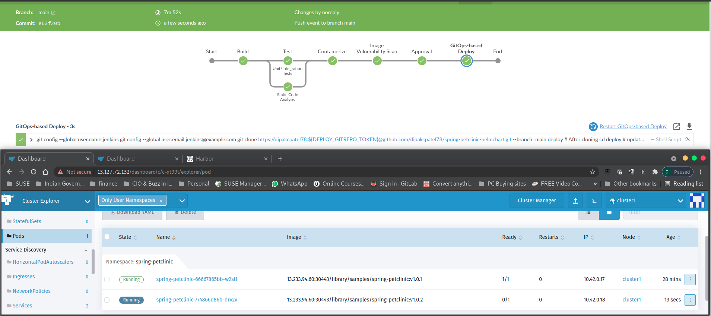

# Part 5 - Put Everything Together

Now, let's modify the source code of the `spring-petclinic` application in Github and commit the changes into `main` branch. We'd expect a new pipeline job will be triggered via Github. 

## 1. Setup your screen layout 

Let's setup your screen layout like below so as to monitor the auto-triggering of Pipeline and Rancher Continuous Delivery.

## 2. Modify source code

1. Navigate to your `spring-petclinic` repo on github with a browser.

2. In the code section, locate this file:

```
src > main > resources > templates > welcome.html
```
Sample Output


3. Modify the file `welcome.html`. Change the greeting text in line 10 from `Hi SUSE Rancher friends!` to anything you like.

Sample Output 


4. Click `Commit Changes` button to continue.

## 3. Observe the new pipeline is running

Observe the new pipeline job is executing to pick up the changes in github and build a new container image for it. After passing all checking, the new build number of this image will be updated in helm chart, which, in turn, will be picked up by Rancher Continuous Delivery to propagate the changes into the target clusters.

Pipeline - Build Job 2 is been build


The new build has completed its static and dynamic code testing & is presently in container creation stage as we see below. 


Anchore has also completed the container image scanning and we finally the approval junction.


Once the approval is provided, the newly container image is then pushed to Harbor


------------------------------------------------------------

New 

Fleet update in the background is happening. 


You will see Build1 (v1.0.1) containaer is up and running (1/1), however build2 container (v1.0.2) is been coming up (0/1)



In a few seconds, we will see the build2-v1-0-2 container up and running & build1-v1-0-1 getting terminated. 


Now, let look at the GitRepo status, 


Let go to Services Page


To open the applicatin, click on `NodePort` to and the application will open in a new browser window.

We expect to see application version `1.0.2` and updated welcome message `Hi SUSE Rancher Parnter & Community friends!` and sure we do see...


We have successfully makes changes to our code, Jenkins has picked up the changes and build the application in a new pipeline on Rancher RKE cluster. 

We have sucessfully build our CI/CD pipeline with SUSE Rancher


